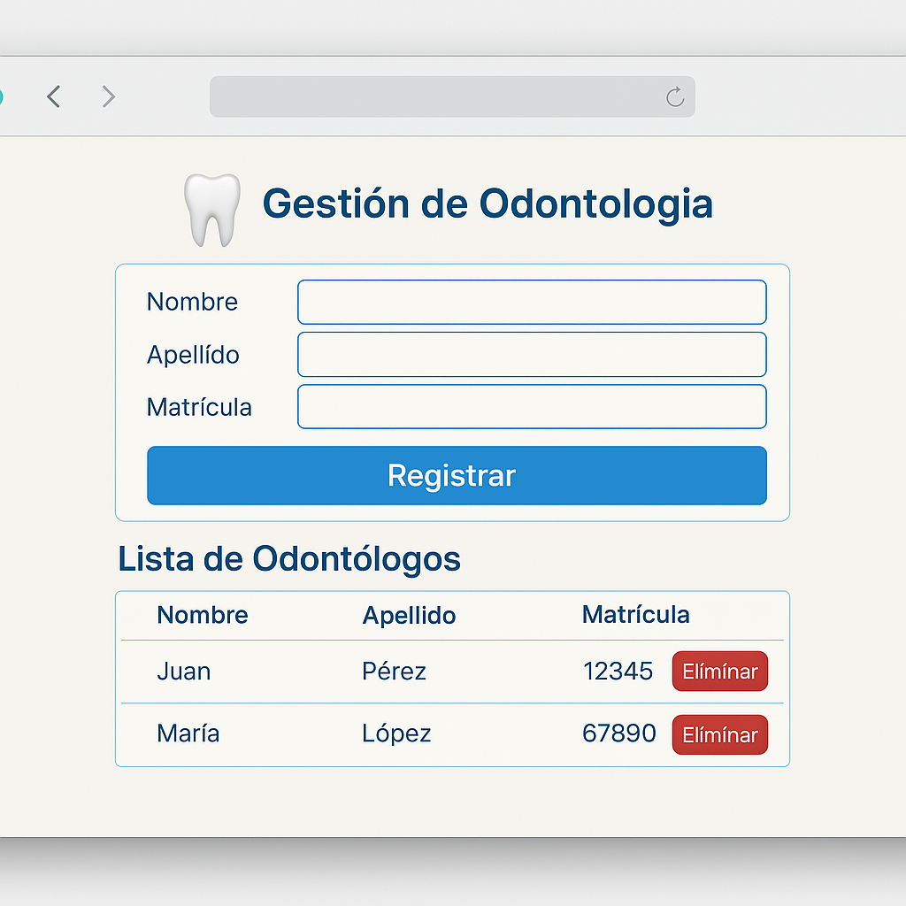

# 🦷 Gestión de Odontólogos - Backend Java



Este proyecto es una aplicación backend desarrollada en Java que permite gestionar odontólogos, con un enfoque limpio y modular usando arquitectura en capas. Es ideal como base para proyectos RESTful más complejos o para propósitos educativos.

---

## ⚙️ Tecnologías Utilizadas

- ☕ Java 11  
- 🛢️ Base de datos en memoria H2  
- 🧱 Maven  
- 🖥️ IntelliJ IDEA  
- 🪵 Log4j  
- 🧪 JUnit  
- 🗃️ SQL  

---

## 🧠 Funcionalidades

- ✅ Registrar odontólogos en la base de datos.  
- 📋 Listar todos los odontólogos registrados.  
- 🆔 Validar matrícula profesional para evitar duplicados.  
- 🧪 Pruebas unitarias para servicios y repositorios.  
- 🪵 Registro de operaciones y errores mediante logs.  

---

## 📁 Estructura del Proyecto

El proyecto sigue una arquitectura en capas:
- `model`: Definición de entidades.
- `repository`: Acceso a datos y lógica de persistencia.
- `service`: Lógica de negocio y validaciones.
- `controller` *(opcional si se convierte en API REST)*: Puerta de entrada para clientes.
- `test`: Pruebas unitarias con JUnit.

---

## 🚀 ¿Cómo ejecutar el proyecto?

1. Clona el repositorio  
   ```bash
   git clone https://github.com/tuusuario/gestion-odontologos.git
